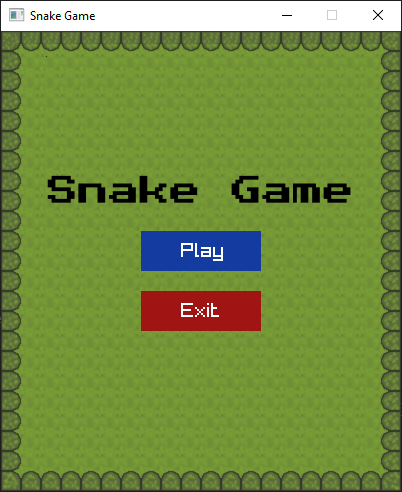
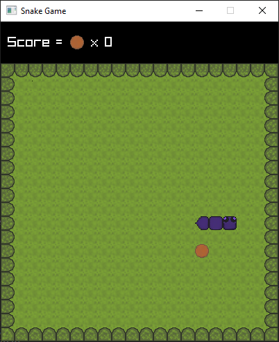
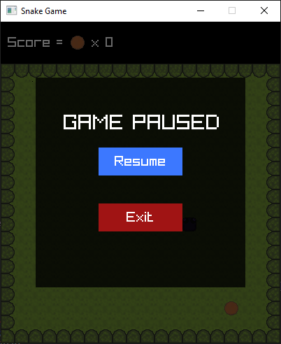
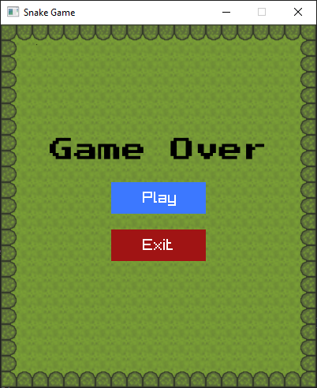

# Snake-clone

A simple Snake game clone written in C++ (using CMake)  
This is a toy/learning project to implement the classic Snake game.

## Table of Contents

- [Features](#features)  
- [Demo / Screenshots](#demo--screenshots)  
- [Getting Started](#getting-started)  
  - [Prerequisites](#prerequisites)  
  - [Building](#building)  
  - [Running](#running)  
- [Controls](#controls)

## Features

- Basic Snake game mechanics: move, grow on food, collision detection  
- Game over condition when hitting walls or self  
- Score tracking  
- Adjustable grid/speed

## Demo / Screenshots

- Stat Scene



- Gameplay



- Pause Menu



- Gameover
  


## Getting Started

### Prerequisites

Make sure you have the following installed on your system:

- A C++ compiler supporting C++11 or newer (e.g. `g++`, MSVC)  
- CMake (version 3.10 or newer)  
- Raylib

### Building

1. Clone the repository

```bash
git clone https://github.com/Poorna-Raj/snake-clone.git
cd snake-clone
```

2. Run CMake to configure
- For minGW
```bash
cmake --preset vcpkg-mingw
```

- For MSVC

```bash
cmake --preset vcpkg-msvc
```

3. Build the project
```bash
cmake --build build
```

4. Running
```bash
# For MinGW
./build/tetris

# For MSVC
./build/Debug/tetris
```

## Controls

|Key | Action|
|----|-------|
|Arrow keys|	Move snake direction|
|TAB	|Pause/Resume|

